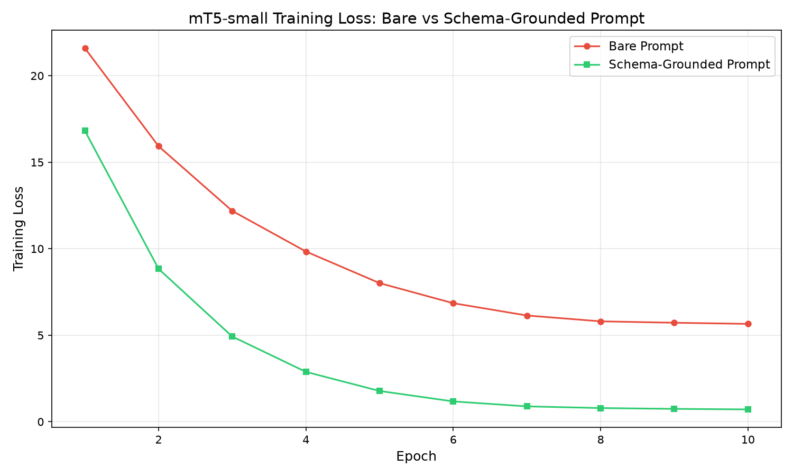

# Does Prompt Formulation Steer a Non-Instruction-Tuned Model During Training?

An empirical benchmark testing whether schema-grounded prompts impact fine-tuning and out-of-distribution generalization on **`google/mt5-small`** (a multilingual encoder-decoder model pretrained solely on self-supervised span corruption).

---

## The Question

> *"Since mT5-small is not instruction-tuned, will the prompt used during training have any impact in steering the model?"*

A common misconception is that prompt engineering only applies to instruction-tuned models (e.g., ChatGPT, Flan-T5, mT0) and that base models ignore prompts. While raw base models indeed fail at *zero-shot* instruction following, **during supervised fine-tuning, the prompt serves as a semantic conditioning anchor for cross-attention**.

This repository provides controlled empirical evidence proving that adding semantic field definitions to the input prompt dramatically accelerates training convergence and enables generalization to unseen entities.

---

## Experiment Setup

* **Model:** `google/mt5-small` (~300M parameters)
* **Training Hardware:** Apple M4 Pro (MPS acceleration with `bfloat16`)
* **Training Data:** 600 synthetic slot-extraction examples
* **Evaluation Splits:**
  * **In-Distribution (ID):** 200 examples with seen entities (cities, items)
  * **Out-of-Distribution (OOD):** 200 examples with unseen cities (e.g., *Bruges*, *Vladivostok*, *Reykjavik*) and unseen item types (e.g., *memos*, *invoices*)
* **Hyperparameters:** AdamW, LR 3e-4, 10 epochs, batch size 16, identical seed (`42`).

### Compared Conditions

Both conditions share the **exact same training data and JSON targets**. Only the input prompt format differs:

#### Condition A: Bare Prompt (No Schema Information)
```text
extract: {query}
```
*Example input:* `extract: share my documents from Bangalore`  
*Target:* `{"act": "share", "add": "Bangalore", "record": "documents"}`

#### Condition B: Schema-Grounded Prompt (With Field Definitions)
```text
extract fields (add=address, act=action, record=item type, time=time period): {query}
```
*Example input:* `extract fields (add=address, act=action, record=item type, time=time period): share my documents from Bangalore`  
*Target:* `{"act": "share", "add": "Bangalore", "record": "documents"}`

---

## Results

### Quantitative Metrics

| Prompt Condition | Test Split | Exact Match Acc | Field-Level Acc | Final Train Loss (10 epochs) |
| :--- | :--- | :---: | :---: | :---: |
| **Bare Prompt** (`extract: ...`) | **In-Distribution** | **0.0%** (0/200) | **0.0%** | `5.655` |
| **Bare Prompt** (`extract: ...`) | **Out-of-Distribution** | **0.0%** (0/200) | **0.0%** | `5.655` |
| **Schema-Grounded** (`extract fields (add=address...): ...`) | **In-Distribution** | **56.5%** (113/200) | **85.5%** | **`0.710`** |
| **Schema-Grounded** (`extract fields (add=address...): ...`) | **Out-of-Distribution** | **31.5%** (63/200) | **70.5%** | **`0.710`** |

> **Net Gain on Unseen Data (OOD):** **+31.5% Exact Match** and **+70.5% Field Accuracy**, with an **$8\times$ lower training loss**.

---

### Loss Convergence Curves



* **Bare Prompt:** Plateaued near loss `5.65`. Without semantic cues, the model could not map cryptic keys (`add`, `act`, `record`) to sentence spans in 10 epochs.
* **Schema-Grounded Prompt:** Dropped smoothly from `16.81` down to `0.71`. The definitions bridged cryptic keys to mT5's rich pretrained vocabulary representations.

---

### Qualitative Analysis (Unseen OOD Test Queries)

#### 1. Unseen City (`Bruges` — never in training data)
* **Input:** `retrieve reminders from Bruges`
* **Target:** `{"act": "fetch", "add": "Bruges", "record": "reminders"}`
* **Bare Prediction:** `<extra_id_0> "record "record "record "record ...` *(Collapsed into pretraining span-corruption loop)*
* **Schema-Grounded Prediction:** `{"act": "fetch", "add": "Bruges", "record": "reminders"}` **(Exact Match ✓)**

#### 2. Unseen City with Time Slot (`Vladivostok`)
* **Input:** `show me videos from Vladivostok, last week`
* **Target:** `{"act": "fetch", "add": "Vladivostok", "record": "videos", "time": "last week"}`
* **Bare Prediction:** `<extra_id_0> " "record": "Show", "record": "record": ...` *(Failed)*
* **Schema-Grounded Prediction:** `{"act": "fetch", "add": "Vladivostok", "record": "videos"}` *(3/4 fields correct, properly identified unseen Russian city as `add`)*

#### 3. Pretrained Knowledge Activation (`Reykjavik` $\rightarrow$ `Iceland`)
* **Input:** `locate videos in Reykjavik`
* **Target:** `{"act": "search", "add": "Reykjavik", "record": "videos"}`
* **Schema-Grounded Prediction:** `{"act": "search", "add": "Iceland", "record": "videos"}`
* **Insight:** Because `add` was defined as `address`, mT5's pretrained world knowledge recognized *Reykjavik* as the capital of *Iceland* and mapped it into the location slot.

---

## Why This Happens

1. **Cross-Attention Conditioning:** The encoder representations form the keys ($K$) and values ($V$) for the decoder cross-attention layers. Including schema definitions alters the latent geometry of the sequence, making relevant spans salient.
2. **Pretrained Semantic Priors:** `mT5` has strong associations for words like *"address"*, *"action"*, and *"location"*, but none for arbitrary abbreviations like `"add"` or `"act"`. Explaining the schema aligns task supervision with existing pretrained weights.
3. **Escaping the Pretraining Attractor:** Without sufficient conditioning, small models with large vocabularies (mT5 has 250k tokens) easily collapse into generating their pretraining sentinel tokens (`<extra_id_0>`).

---

## Project Structure

```
.
├── generate_data.py       # Generates train, ID test, and OOD test splits
├── train.py               # mT5-small training loop (bfloat16 on MPS/CUDA)
├── evaluate.py            # Greedy generation and exact-match / field-accuracy evaluation
├── run_experiment.py      # End-to-end benchmark orchestrator
├── requirements.txt       # Dependencies
├── data/                  # Generated datasets (JSON)
└── results/
    ├── loss_curves.png    # Training loss plot
    ├── metrics.json       # Quantitative metrics
    └── predictions_*.json # Predictions per split
```

---

## How to Reproduce

```bash
# 1. Create and activate virtual environment
python3 -m venv .venv
source .venv/bin/activate

# 2. Install dependencies
pip install -r requirements.txt

# 3. Run the full benchmark
python run_experiment.py
```
